# My Movies Bucket lists

***Raed Abdennadher & Ludovic Gindre***

------

## Introduction

My Movies Bucket lists est une application faite pour les cinéphiles qui souhaitent partager des moments à regarder des films avec d'autres cinéphiles. Elle permet de créer et de partager avec d'autres cinéphiles des "bucket lists" de films. Chaque cinéphile peut alors choisir d'ajouter un film à la liste. Lorsque les cinéphiles ont vus un film de la liste, ils peuvent le taguer comme vu afin qu'il n'aparaisse plus dans la catégorie des films à voir. Une liste est indépendante des autres. Lorsqu'un cinéphile a vu un film avec un autre cinéphile, cela n'impactera pas les listes qu'il partage avec d'autres cinéphiles.

## Analyse

Il existe beaucoup d'applications qui offrent la possibilité de créer une liste de lecture pour permettre aux utilisateurs de garder une trace des films qu'ils ont vus et des films qu'ils veulent voir. Cependant, nous n'avons pas trouvé d'application qui permette de partager des listes entre ses utilisateurs. Nous trouvons que cet aspect communautaire et de partage est ce qui manque aux applications qui existent déjà sur le marché. C'est pourquoi nous avons décidé de créer My Movies Bucket lists.

l'application est divisée en plusieurs entités distinctes. La première entité est l'utilisateur. Il peut créer un compte et se connecter. Ensuite vient la seconde entité, la bucket list. Elle peut être créée par un utilisateur qui peut la partager avec d'autres utilisateurs. Un utilisateur peut créer autant de bucket list qu'il le veut. Enfin la troisième entité est le film. Un film peut être ajouté dans une bucket list. Au sein d'une bucket list un film possède un attribut pour savoir si il a été visionné ou non. Les données des films proviennent d'une API spécialisée comme "The Movie DB" ou encore "IMDB". Dans le cadre de ce projet, nous utiliserons "The Movie DB".

## Conception

### Méthodologie

Pour réaliser ce projet, nous avons travaillé principalement en **Extreme Programming**. Nous avons commencé par fixer les tâches et les fonctionnalités de base de notre application, et nous avons itéré là-dessus.

### Architecture générale

Notre projet respecte l'architecture **MVVM** (Model, View, View-Model) :

* Model : les classes de données
* View : les éléments de l'interface graphique (UI)
* View-Model : la logique qui permet de séparer les données des traitements (dans notre cas, les traitements serons les appels aux différentes ressources externes), et qui assure la liaison entre les données et les éléments graphiques

Après avoir fait quelques recherches, nous avons décidé d'utiliser les services **Firebase** de Google pour le stockage de données, et l'API **The Movie Database** comme source de films (plus d'explications d'utilisation et d'intégration dans la partie *Implémentation*).

La figure suivante (figure 1) illustre l’architecture générale :

<figure class="image">
  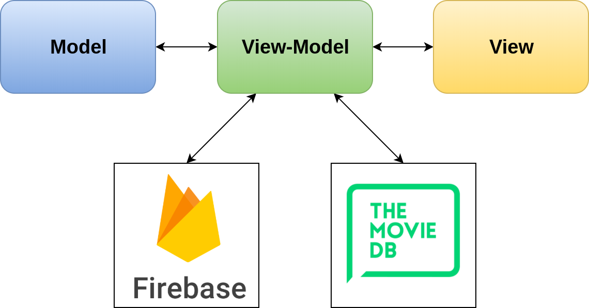
  <figcaption style="text-align: center">
    <em>Figure 1 : Architecture générale</em>
  </figcaption>
</figure>

### Cas d'utilisation

Les différents cas d'utilisation de notre application sont les suivants :

Après avoir été identifié, un utilisateur peut

* Afficher les bucket lists qu'il a créées et les bucket lists partagées avec lui
* Créer une bucket list
* Modifier une bucket list qu'il a créée
* Supprimer une bucket list qu'il acréée
* Ouvrir une bucket list et consulter la liste des films dans celle là
* Ajouter un film à une bucket list
* Supprimer un film dans une bucket list
* Marquer un film comme "vu"
* Chercher un film par son titre pour l'ajouter à une bucket list
* Regarder la bande-annonce d'un film
* Consulter la description d'un film

Le diagramme de cas d'utilisation suivant (figure 2) illustre les fonctionnalités de notre application :

<figure class="image">
  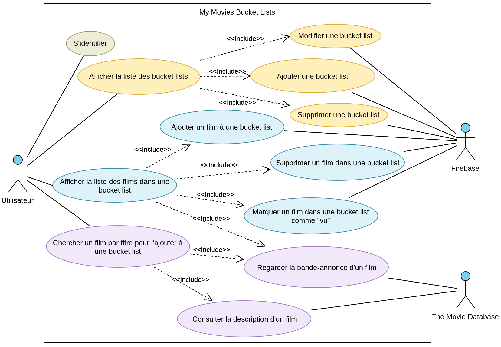
  <figcaption style="text-align: center">
    <em>Figure 2 : Diagramme de cas d'utilisation</em>
  </figcaption>
</figure>

### Recherche et ajout de films dans une bucket List

Nous allons présenter le scénario le plus important (figure 3) par un diagramme de séquence : Recherche et ajout de films dans une bucket list :

<figure class="image">
  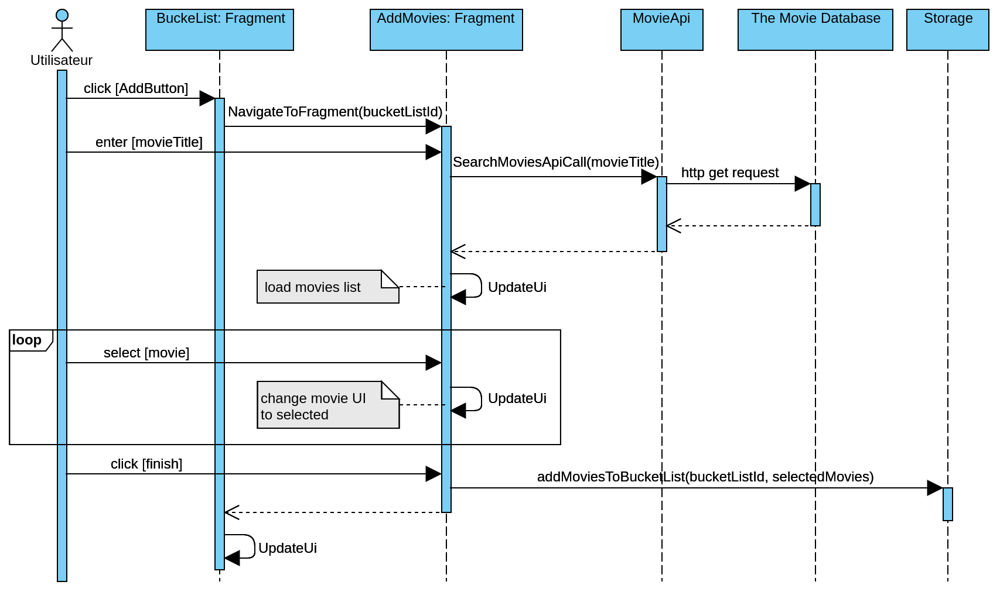
  <figcaption style="text-align: center">
    <em>Figure 3 : Recherche et ajout de films dans une bucket list</em>
  </figcaption>
</figure>

### Diagramme de classe

Pour respecter l'architecture général, nous avons organisé nos classes en packages (figure 4) :

* **Model** : contient les classes modèles de notre application : `User`, `Bucketlist`, `Movie` et `Video`
* **View** : contient les classes qui construisent l'interface utilisateur (activités, fragments...)
* **ViewModel** : contient les classes responsables de la liaison entre les vus et les modèle, et les appels vers les librairies externes : `BucketlistViewModel` pour Cloud Firestore et `MovieViewModel` pour The Movie Database
* **Firebase** : contient les classes qui sont en liaison directe avec les librairie de Firebase : Cloud Firestore et FirebaseAuth
* **TMDApi** : contient une classe qui envoie des requêtes http au serveur The Movie Database via leur API

<figure class="image">
  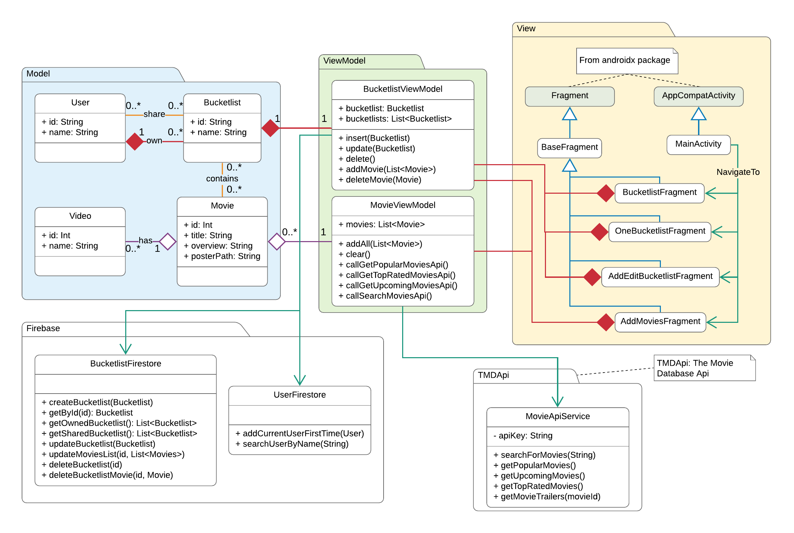
  <figcaption style="text-align: center">
    <em>Figure 4 : Diagramme de classes</em>
  </figcaption>
</figure>

## Implémentation

Nous avons choisi d'utiliser les services **Firebase** de Google pour le stockage de données et la gestion d'authentification, qui offre des librairies riches et complètes Nous avons utilisé les services suivants :

* Le service d'authentification ***Authentification*** : plusieurs fournisseur de connexion possibles : email/Mot de passe, Téléphone, Google, Facebook, Twitter...
* Le service de base de données ***Cloud Firestore*** (*NoSql data base*) : On a deux collections : `users` et `bucketlists`

Pour la partie qui concerne la recherche des films, nous avons choisi d'utiliser l'API offerte par **The Movie Database**.

### Gestion d'authentification

Nous avons essayé de respecter notre architecture que nous avons conçu initialement (MVVM), mais nous avons remarqué, au moment de l'implémentation de la gestion d'authentification, que nous devons faire autrement pour des raisons de simplification.

Voici la logique que nous avons appliqué :

* 3 activités :
  
  * ***SplashActivity*** : cette activité va tout simplement vérifier si l'utilisateur est déjà connecté. Grace à Firebase, cela peut se faire facilement en testant si l'instance de `FirebaseAuth.getInstance().currentUser` est nulle. Si c'est le cas, alors l'utilisateur n'est pas connecté, et l'activité `SignInActivity` va se lancer. Sinon, c'est l'activité `MainActivity` qui va se lancer :
  
  ```kotlin
  if (FirebaseAuth.getInstance().currentUser == null) {
      startActivity(Intent(this, SigninActivity::class.java))
  } else {
      startActivity(Intent(this, MainActivity::class.java))
  }
  ```
  
  * ***SignInActivity*** : cette activité permet à l'utilisateur de se connecter à son compte. Deux méthodes de connexion possibles : 
  
    * **Par adresse e-mail et mot de passe** (figure 5) : il faut d’abord avoir un compte pour pouvoir se connecter (Si ce n'est pas le cas, l'utilisateur doit en créer dans l'activité `SignUpActivity` en cliquant sur `Create one`). Une fois les informations saisies, l'email va être enregistré dans les préférences partagées de l'application afin d'afficher une liste de suggestion la prochaine fois où l'utilisateur se connecte à nouveau (figure 6). Voici un extrait du code qui permet de se connecter avec un email et mot de passe :
  
    ```kotlin
    FirebaseAuth.getInstance().signInWithEmailAndPassword(email, password)
        .addOnCompleteListener {
            if (it.isSuccessful) {
                goToMainActivity()
            } else {
                // handle connection failure
            }
        }
    ```
  
    * **Par un compte Google connecté dans l'appareil** (figure 7) : grâce à Firebase, faire la liaison entre l'application et les comptes enregistrés dans l'appareil devient une tâche facile. Tout d'abord on commence par lancer un `intent`  spécial fourni utilisant la méthode `startActivityForResult`, et après on récupère les informations de connexion (`credentials`) dans la méthode `onActivityResult`. Avec ce mode de connexion, et si l'utilisateur se connecte pour la première fois à l'application, un nouveau document dans la collection `users` de Cloud Firestore, avec l'id généré par Firebase et le nom utilisateur, va être ajouté.
  
    ```kotlin
    ...
    val gso = GoogleSignInOptions.Builder(GoogleSignInOptions.DEFAULT_SIGN_IN)
        .requestIdToken(getString(R.string.default_web_client_id))
        .requestEmail()
        .build()
    val googleSignInClient = GoogleSignIn.getClient(this, gso)
    val signInIntent = googleSignInClient.signInIntent
    startActivityForResult(signInIntent,RC_GOOGLE_SIGN_IN)
    ...
    override fun onActivityResult(requestCode: Int, resultCode: Int, data: Intent?) {
        super.onActivityResult(requestCode, resultCode, data)
        if (requestCode == RC_GOOGLE_SIGN_IN) {
            val task: Task<GoogleSignInAccount> = GoogleSignIn.getSignedInAccountFromIntent(data)
            try {
                val account = task.getResult(ApiException::class.java)
                // check if it's the first time
                firebaseAuthWithGoogle(account)
                goToMainActivity()
            } catch (e: ApiException) {
                // handle connection failure
            }
        }
    }
    ```
  
  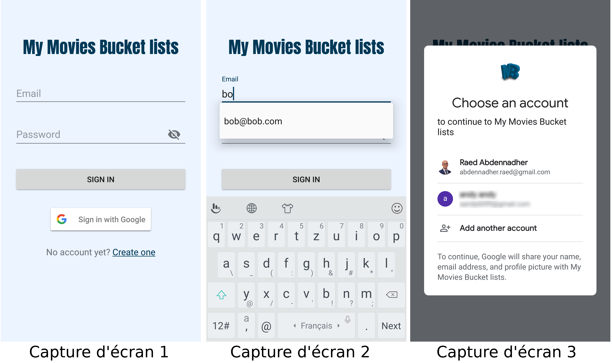

* ***SignUpActivity*** (figure 8) : cette activité permet à l'utilisateur de créer un compte (email/mot de passe) pour pouvoir se connecter et utiliser l'application. En cliquant sur le bouton `SING UP`, un nouveau document dans la collection `users` de Cloud Firestore, avec l'id généré par Firebase et le nom utilisateur, va être ajouté.

```kotlin
...
FirebaseAuth.getInstance().createUserWithEmailAndPassword(email, password)
    .addOnCompleteListener {
        if (it.isSuccessful) {
            UserFirestore.addUserIfFirstTime {
                val intent = Intent(this, MainActivity::class.java)
                startActivity(intent)
                finish()
            }
        } else {
            // handle connection failure
        }
    }
```

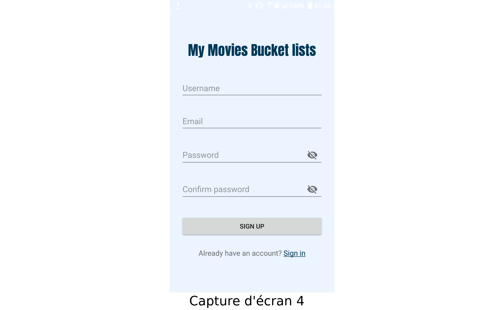

### Gérer les bucket lists

Après avoir se connecter, l'activité `MainActivity` se lance (figure 9). Cette activité contient principalement :

* Un objet `NavigationView` qui permet à l'utilisateur de se déconnecter (figure 6)

  ```xml
  <com.google.android.material.navigation.NavigationView
      android:id="@+id/nav_view"
      ...
      app:headerLayout="@layout/nav_header_main"
      app:menu="@menu/activity_main_drawer_menu" />
  ```

* Un objet `fragment` qui permet de charger les différents fragments définis dans le *Navivation Graph* `mobile_navigation.xml`

  ```xml
  <fragment
  	android:id="@+id/nav_host_fragment"
  	android:name="androidx.navigation.fragment.NavHostFragment"
  	...
  	app:defaultNavHost="true"
  	app:navGraph="@navigation/mobile_navigation" />
  ```

  Le fichier `mobile_navigation.xml` permet de gérer les différentes transactions et actions entre les différents fragment, et les différents arguments qu'ils peuvent communiquer.

<figure class="image">
  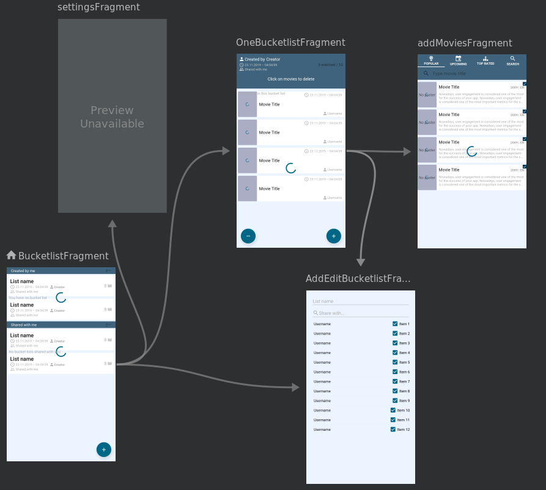
  <figcaption style="text-align: center">
    <em>Figure 9 : Diagramme de classes</em>
  </figcaption>
</figure>

Comme on peut le remarquer dans ce graphe, le fragment qui va s'afficher en premier dans la `MainActivity` sera `BucketlistFragment` (l’icône de la maison).

#### BucketlistFragment

Depuis ce fragment, l'utilisateur peu :

* Se déconnecter (figure 11)

* Consulter la liste des bucket lists qu'il a créées lui même ("Comedy" et "Action" dans le figure 10) et celles partagées avec lui, que d'autres utilisateurs ont créées ("Drama"). Deux objets `RecyclerView` vont contenir ces deux listes, et les mettre à jour grâce à un adaptateur spécial offert par la librairie de Cloud Firestore : `FirestoreRecyclerAdapter<Model, ViewHolder>(options)`, en voici l'utilisation :

  ```kotlin
  ...
  private val firestoreInstance: FirebaseFirestore by lazy { 
      FirebaseFirestore.getInstance() 
  }
  ...
  val bucketlistsCollRef = firestoreInstance.collection("bucketlists")
  val query = bucketlistsCollRef
  	.whereEqualTo("createdBy.id", FirebaseAuth.getInstance().currentUser!!.uid)
  	.orderBy("creationTimestamp", Query.Direction.DESCENDING)
  
  val recyclerOptions = FirestoreRecyclerOptions.Builder<Bucketlist>()
      .setQuery(query, Bucketlist::class.java)
      .build()
  
  val recyclerAdapterOwned = 
  	BucketlistAdapter(recyclerOptions, BucketlistAdapter.Type.OWNED)
  ```

  ```kotlin
  class BucketlistAdapter(
      options: FirestoreRecyclerOptions<Bucketlist>, 
      private val type: Type
  ) : FirestoreRecyclerAdapter<Bucketlist, BucketlistHolder>(options) {
      enum class Type { OWNED, SHARED}
      ...
       inner class BucketlistHolder(
           private val view: View, 
           private val type: Type
       ): RecyclerView.ViewHolder(view) {
           ...
       }
      ...
  }
  ```

* Ajouter une bucket list en cliquant sur le bouton flottant "+" en bas à gauche

* Modifier une de ses propres bucket lists en glissant (swipe) l'élément vers la droite (figure 12)

* Supprimer une de ses propres bucket lists en glissant (swipe) l'élément vers la gauche (figure 13)

Pour les actions de "swipe", nous avons créé une classe `ItemSwipeController` qui hérite de la classe abstraite `ItemTouchHelper.Callback`, et que nous avons attaché à notre `RecyclerView` :

```kotlin
class ItemSwipeController(
    private val buttonsActions: OnSwipedListener,
    private val directions: Int
): ItemTouchHelper.Callback() {
    ...
    fun onDraw(c: Canvas) {
        if (currentItemViewHolder != null) {
            // Draw the edit and the delete round buttons
            drawButtons(c)
        }
    }
    interface OnSwipedListener {
        fun onDeleteButtonClick(position: Int)
        fun onEditButtonClick(position: Int)
    }
}

// Usage:
val swipeController = ItemSwipeController(
    object : ItemSwipeController.OnSwipedListener {
        override fun onDeleteButtonClick(position: Int) {
            // Delete routine
        }
        override fun onEditButtonClick(position: Int) {
            // Edit routine
        }
    }, 
    ItemTouchHelper.LEFT or ItemTouchHelper.RIGHT
)

val itemTouchhelper = ItemTouchHelper(swipeController)
itemTouchhelper.attachToRecyclerView(recyclerViewOwned)

recyclerViewOwned.addItemDecoration(object : ItemDecoration() {
    override fun onDraw(c: Canvas, parent: RecyclerView, state: RecyclerView.State) {
        swipeController.onDraw(c)
    }
})
```

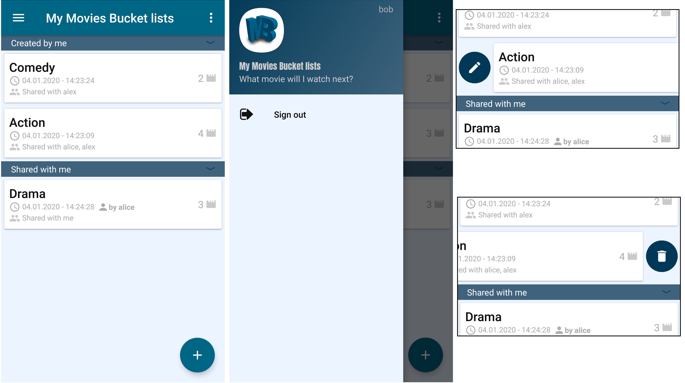

#### AddEditBucketlistFragment

Quand l'utilisateur choisie d'ajouter (figure 14) ou de modifier (figure 15) une bicket list, l'activité principale va charger ce fragment `AddEditBucketlistFragment`. Dans les deux cas, ce fragment est chargé avec les arguments suivants : `fragmentTitle: String`, `bucketlistId: String` et `action: Enum` (peut être `ADD` ou `EDIT`)

```xml
<fragment android:id="@+id/AddEditBucketlistFragment" ... >
    <argument
         android:name="fragmentTitle"
         app:argType="reference"
         android:defaultValue="@string/new_bucket_list" />
    <argument
         android:name="bucketlistId"
         app:argType="string"
         app:nullable="true"
         android:defaultValue="@null" />
    <argument
         android:name="action"
         app:argType="mse.mobop.mymoviesbucketlists.utils.BucketlistAction"
         android:defaultValue="ADD" />
```

* S'il s'agit d'une opération d'ajout, les arguments auront les valeurs par défaut `New bucket list`, `null` et `ADD` respectivement :

  ```kotlin
  findNavController()
      .navigate(R.id.action_BucketlistsFragment_to_AddEditBucketlistFragment)
  ```

* S'il s'agit d'une opération de modification, les arguments auront les valeurs `Edit bucket list`, `<l'id de la bucket list en question>` et `EDIT` respectivement :

  ```kotlin
  val direction = BucketlistFragmentDirections
  	.actionBucketlistsFragmentToAddEditBucketlistFragment(
          fragmentTitle = R.string.edit_bucket_list,
          bucketlistId = bucketlist.id,
          action = BucketlistAction.EDIT
      )
  findNavController().navigate(direction)
  ```

> `action_BucketlistsFragment_to_AddEditBucketlistFragment` est définie dans le `NavGraph` :
>
> ```xml
> <fragment android:id="@+id/BucketlistFragment" ... >
> 	<action
> 		android:id="@+id/action_BucketlistsFragment_to_AddEditBucketlistFragment"
>         app:destination="@id/AddEditBucketlistFragment"
>         ... />
>     ...
> </fragment>
> ```

Dans le fragment `AddEditBucketlistFragment`, on peut récupérer les valeurs des arguments via la méthode statique `AddEditBucketlistFragmentArgs.fromBundle(arguments!!)` générée par Android Studio au moment du `Build` de l'application, grace au `NavGraph` :

```kotlin
val bandle = AddEditBucketlistFragmentArgs.fromBundle(arguments!!)
val fragmentTitle = bandle.fragmentTitle
val bucketlistId = bandle.bucketlistId
val action = bandle.action
```

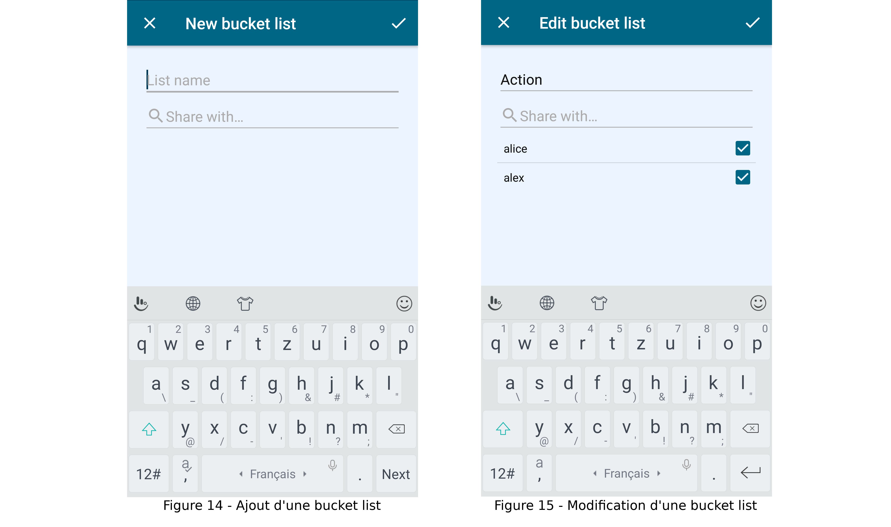

#### OneBucketlistFragment

Par un simple clic sur un des éléments des `RecyclerView`s dans le fragment `BucketlistFragment` (figure 10), le système navigue vers le fragment `OneBucketlistFragment` (figure 16) en suivant la même logique expliqué dans la partie précédente (utilisant le `NavGraph`). Ce fragment attend les arguments suivants :

* `bucketlistId: String` utilisé pour chargé la bucket list en question depuis la base de données Cloud Firestore
* `ownerId: String` utilisé pour mettre en place ou pas, à l'utilisateur, le menu pour modifier et supprimer la bucket list (les bouton en haut à droite dans la figure 16)

La liste des films du bucket list est représentée dans un `RecyclerView` : le poster du film, sont titre, et la date dans laquelle ce film à été ajouté à cette bucket list. Pour toutes les images qui viennent depuis internet dans notre application, nous avons utilisé la librairie ***Glide*** (v4.10.0) (lien dans les références). L'utilisation de cette librairie est très simple. Il suffit de fournir principalement le contexte, l'URL vers l'image en question, l'objet `ImageView` dans lequel nous voulons charger l'image (en mode asynchrone), et les routines des actions à exécuter en cas de succès ou d’échec :

```kotlin
Glide
    .with(context)
    .load(BASE_URL_IMG + movie.posterPath)
    .listener(object : RequestListener<Drawable> {
        override fun onResourceReady(
            resource: Drawable?,
            model: Any?,
            target: com.bumptech.glide.request.target.Target<Drawable>?,
            dataSource: DataSource?,
            isFirstResource: Boolean
        ): Boolean {
            // Handle success
            return false
        }
        override fun onLoadFailed(
            e: GlideException?,
            model: Any?,
            target: com.bumptech.glide.request.target.Target<Drawable>?,
            isFirstResource: Boolean
        ): Boolean {
            // Handle failure
            return false
        }
    })
    .diskCacheStrategy(DiskCacheStrategy.ALL) // Cache both original & resized image
    .centerCrop() // Center and crop the image in its container
    .transition(withCrossFade()) // Image apears with fade animation
    .into(movie_poster) // Container => ImageView
```

Le simple clic sur un film bascule l'état du film (non vue / déjà vu). Le clic sur le bouton "-" en bas à gauche va changer la vu en mode suppression : cela change l'action du clic sur un film à une action de suppression à la place le l'action de basculement (figure 17). Le clic long sur un élément permet d'ouvrir un `AlertDialog` personnalisé affichant le poster, la description et les différentes bandes-annonces et vidéos liées au film (figure 18). Pour afficher le poster avec un dégradé transparent, nous avons utilisé la librairie **Android-FadingEdgeLayout** (v1.0.0) :

```xml
<com.bosphere.fadingedgelayout.FadingEdgeLayout
	android:id="@+id/fading_edge_layout"
	android:layout_width="match_parent"
	android:layout_height="wrap_content"
	app:fel_edge="bottom"
	app:fel_size_bottom="80dp">
    <ImageView
        android:id="@+id/movie_backdrop"
		android:layout_width="match_parent"
		android:layout_height="wrap_content"
		android:minHeight="150dp"
		android:scaleType="centerCrop"/>
</com.bosphere.fadingedgelayout.FadingEdgeLayout>
```

Les différentes informations liées à un film (depuis The Movie Database) sont déjà enregistrées dans la base de données Cloud Firestore au moment de l'ajout d'un film dans une bucket list (explication dans la partie suivante). Mais pour les vidéos liées au film, il faut lancer une nouvelle requête`GET` vers l'API The Movie Database `movie/{movie_id}/videos`. La réponse de cette requête est une liste de vidéos YouTube identifiées par un `key`. Pour afficher les vidéos YouTube, nous avons utiliser la librairie ***android-youtube-player*** fournie par **PierfrancescoSoffritti** (lien dans les références). Nous avons préféré d'utiliser cette librairie, à la place de la librairie officielle de YouTube *YouTube Android Player API*, pour différentes raisons expliquées dans la partie **Problèmes rencontrés**. L'utilisation de cette librairie :

* Ajout de l'objet `YouTubePlayerView` dans la vue :

```xml
<com.pierfrancescosoffritti.androidyoutubeplayer.core.player.views.YouTubePlayerView
        android:id="@+id/youtube_player_view"
        android:layout_width="wrap_content"
        android:layout_height="wrap_content"
        app:showFullScreenButton="false"/>
```

* Chargement de la vidéo dynamiquement :

```kotlin
youtubePlayerView.addYouTubePlayerListener(
    object : AbstractYouTubePlayerListener() {
        override fun onReady(youTubePlayer: YouTubePlayer) {
            youTubePlayer.loadVideo(video.key, 0f)
            // First parameter is the video youtube key
            // Second parameter is from where to start the video (in seconds)
        }
    }
)
```


#### AddMoviesFragment

Le clic sur le bouton "+" en bas à droite du fragment précédent va charger le fragment `AddMoviesFragment` dans l'activité principale. Ce fragment contient un objet `TabLayout` avec 4 éléments `TabItem` (figure 19). Le clic sur un élément `TabItem` va demander au `MovieViewModel` du fragment de lancer une requête http `GET` vers l'API The Movie Database :

1. **POPULAR** : charger et afficher la liste des films populaires actuellement sur TMDb
2. **UPCOMING** : charger et afficher la liste des films à venir dans les salles de cinéma
3. **TOP RATED** : charger et afficher la liste des films les mieux notés sur TMDb
4. **SEARCH** : permet d'effectuer une recherche de film par titre (figure 21), de charger et afficher le résultat de la recherche

Les résultats de tous ces requêtes sont représentés dans un objet `RecyclerView`, dont on change le contenu en fonction de la requête demandée. Le simple clic sur le poster du film va l'agrandir dans un `AlertDialog` (figure 20). Le clic long sur le poster va ouvrir un `AlertDialog` contenant un `YouTubePlayerView` pour jouer les différentes bandes-annonces du film (figure 22). Le clic long sur la description d'un film permet de le sélectionner pour l'ajouter plus tard dans la bucket list (en cliquant sur le menu **check** en haut à droite dans les figures 19 et 21).

Pour effectuer les appels des requêtes http, nous avons utilisé la librairie ***Retrofit*** (v2.7.0). Pour convertir le résultat des requêtes du `json` vers des objets, nous avons utilisé la librairie ***Gson Converter*** (v2.7.0) de Retrofit. Pour pouvoir déboguer ce que Retrofit fait, nous avons utilisé la librairie ***Logging Interceptor*** (v4.0.1).

Pour utiliser ces librairies :

* Définir le client http avec le débogueur et le convertisseur :

  ```kotlin
  object MovieApi {
      private var retrofit: Retrofit? = null
  
      private fun buildClient(): OkHttpClient? {
          val httpLoggingInterceptor = HttpLoggingInterceptor()
          return OkHttpClient
              .Builder()
              .addInterceptor(httpLoggingInterceptor.apply {
                  httpLoggingInterceptor.level = HttpLoggingInterceptor.Level.BODY
              })
              .build()
      }
  
      val client: Retrofit?
          get() {
              if (retrofit == null) {
                  retrofit = Retrofit.Builder()
                      .client(buildClient()!!)
                      .addConverterFactory(GsonConverterFactory.create())
                      .baseUrl(BASE_URL_API)
                      .build()
              }
              return retrofit
          }
  }
  ```

* Définir les routes de l'API qu'on va utiliser :

  ```kotlin
  interface MovieService {
      @GET("movie/popular")
      fun getPopularMovies(
          @Query("page") pageIndex: Int,
          @Query("api_key") apiKey: String = BuildConfig.THE_MOVIE_DATABASE_API_KEY,
          @Query("include_adult") includeAdpult: Boolean = false,
          @Query("language") language: String? = "en_US"
      ): Call<MoviesSearchResult?>?
  }
  ```

* Créer une instance du client http :

  ```kotlin
  private val movieService = MovieApi.client!!.create(MovieService::class.java)
  ```

* Et finalement effectuer l'appel et récupérer le résultat (exemple avec `getPopularMovies`) :

  ```kotlin
  data class MoviesSearchResult(
      @SerializedName("page") val page : Int?,
      @SerializedName("total_results") val totalResults : Int?,
      @SerializedName("total_pages") val totalPages : Int?,
      @SerializedName("results") val results : List<Movie>?
  )
  ```

  ```kotlin
  movieService.getPopularMovies(currentPage).enqueue(
      object : Callback<MoviesSearchResult?> {
          override fun onResponse(
              call: Call<MoviesSearchResult?>?,
              response: Response<MoviesSearchResult?>?
          ) { // Got data.
              val moviesSearchResult = response!!.body()!!
  
              val results = moviesSearchResult.results!! as ArrayList<Movie>
              // Add results to the RecyclerView
          }
          
          override fun onFailure(call: Call<MoviesSearchResult?>?, t: Throwable) {
              // Handle failure
          }
      }
  )
  ```


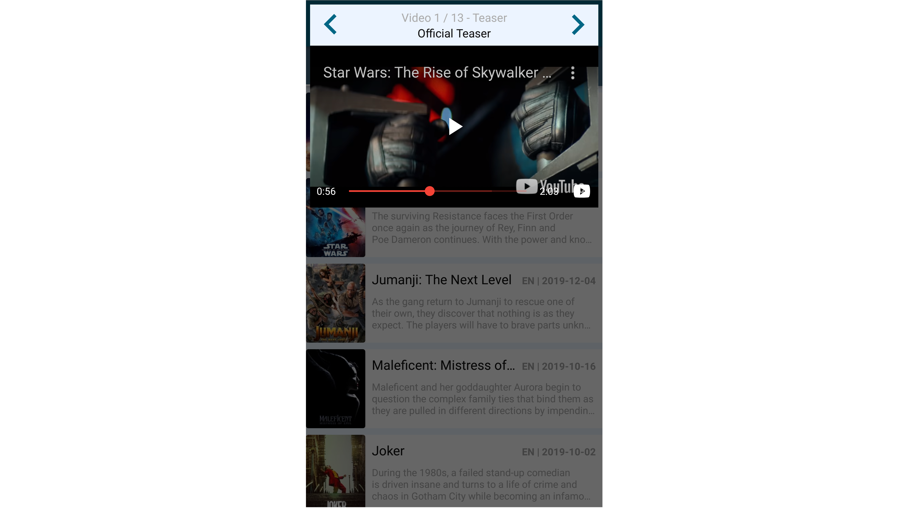

### Support de deux thèmes

Notre application est disponible en deux thèmes : clair (le thème par défaut) et sombre (figure 23). Pour changer le thème, il suffit d'ouvrir les paramètres de l'application depuis le fragment d’accueil et cliquer sur `Enable dark theme`.

Sous avons commencé par définir des attributs pour les différents éléments dans le fichier de ressources `attrs.xml` :

```xml
<resources>
    ...
    <attr name="colorAppBackground" format="reference"/>
    <attr name="colorTitle" format="reference"/>
    <attr name="colorSubTitle" format="reference"/>
    <attr name="colorCardBackground" format="reference"/>
    ...
</resources>
```

Ensuite, nous avons défini les différents couleurs des deux thèmes dans le fichier de ressources `colors.xml` :

```xml
<resources>
<!--    Default theme-->
    ...
    <color name="colorPrimaryDefault">#006685</color>
    <color name="colorAppBackground">#ECF4FF</color>
    <color name="colorTitle">#121212</color>
    <color name="colorCardBackground">#fff</color>
    ...
<!--    Dark theme-->
    ...
    <color name="colorPrimaryDark">#003957</color>
    <color name="colorAppBackgroundDark">#121212</color>
    <color name="colorTitleDark">#fff</color>
    <color name="colorCardBackgroundDark">#2B2B2B</color>
    ...
</resources>
```

Finalement, dans le fichier `themes.xml` nous avons défini les deux thèmes  `AppTheme` et `AppThemeDark` en affectant les couleurs aux attributs précédemment définis :

```xml
<!-- Base application theme. -->
<style name="AppTheme" parent="Theme.AppCompat.Light.DarkActionBar">
    ...
    <item name="colorAppBackground">@color/colorAppBackground</item>
    <item name="colorTitle">@color/colorTitle</item>
    <item name="colorSubTitle">@color/colorTitle</item>
    <item name="colorCardBackground">@color/colorCardBackground</item>
    ...
</style>
<!--    Dark theme-->
<style name="AppThemeDark" parent="Theme.AppCompat.Light.DarkActionBar">
    ...
    <item name="colorAppBackground">@color/colorAppBackgroundDark</item>
    <item name="colorTitle">@color/colorTitleDark</item>
    <item name="colorSubTitle">@color/colorTitleDark</item>
    <item name="colorCardBackground">@color/colorCardBackgroundDark</item>
    ...
</style>
```

Si par exemple on veut donner une couleur à un titre de film (`TextView`), au lieu d'affecter `@color/colorTitle` à la propriété `android:textColor`, on affecte l'attribut correspondant                            `?attr/colorTitle`. Et au moment de la création de la vue, si le thème de l'application est définie comme `AppTheme`, alors la couleur `colorTitle (#121212)` qui va être affectée, et si le thèmes est `AppThemeDark`, alors c'est la couleur `colorTitleDark (#fff)` qui va être affectée :

```xml
<TextView
	...
	android:textColor="?attr/colorTitle"
	... />
```

La page de changement de thème est un fragment de type `PreferenceFragmentCompat`, dont la vue est définie dans le fichier `settings.xml` (dans le dossier de ressources `xml`) :

```xml
<PreferenceScreen xmlns:android="http://schemas.android.com/apk/res/android">
    <PreferenceCategory
        android:title="@string/app_theme"
        android:icon="@drawable/ic_theme"/>
    <SwitchPreferenceCompat
        android:key="app_theme"
        android:title="@string/enable_dark_theme" />
</PreferenceScreen>
```

Quand l'élément `SwitchPreferenceCompat` change de valeur avec un clic de l'utilisateur, cette valeur (`true`/`false`) va être enregistrer dans les préférences partagées de l'application avec l'ID de l'utilisateur connecté, et l'activité sera recharger avec le thème choisi (figure 23) :

```kotlin
val themeSwitcher = findPreference<SwitchPreferenceCompat>("app_theme")
themeSwitcher?.onPreferenceChangeListener =
	Preference.OnPreferenceChangeListener { 
        _, new_value ->
            sharedPref.edit()
                .putBoolean(CURRENT_THEME, new_value as Boolean)
                .apply()

            activity?.finish()
            startActivity(activity!!.intent)
            true
    }

// Variable CURRENT_THEME is defined as follows
val CURRENT_THEME
    get() = "app.theme.current." + FirebaseAuth.getInstance().currentUser!!.uid
```

et dans la `MainActivity` on charge le thème :

```kotlin
class MainActivity : AppCompatActivity() {
    private var currentTheme: Boolean = false
    private lateinit var sharedPref: SharedPreferences
    
    override fun onCreate(savedInstanceState: Bundle?) {
        super.onCreate(savedInstanceState)
        sharedPref = getSharedPreferences(THEME_PREF, MODE_PRIVATE)
        currentTheme = sharedPref.getBoolean(CURRENT_THEME, false)
        setAppTheme(currentTheme)
        ...
    }

    override fun onResume() {
        super.onResume()
        val theme = sharedPref.getBoolean(CURRENT_THEME, false)
        if(currentTheme != theme)
            recreate()
        ...
    }

    private fun setAppTheme(currentTheme: Boolean) {
        setTheme(
            if (currentTheme) R.style.AppThemeDark_NoActionBar 
            else R.style.AppTheme_NoActionBar
        )
    }
}
```

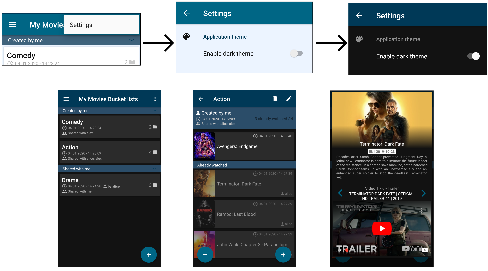

### Support de deux languess

Notre application supporte deux langages : Français et Anglais. Tout le contenue de notre application est traduit dans les deux langues dans les ressources `string.xml`.

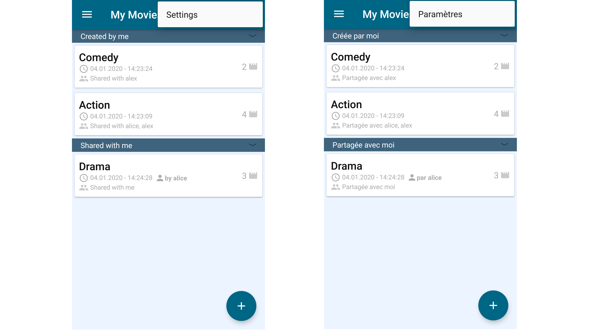

## Problèmes rencontrés


## Conclusion

D'une manère générale, nous avons travaillé en extreme programming. Le gros de l'application a donc été réalisé par les deux membres du groupe. Nous avons choisi cette manière de travailler parce que le projet nous le permettait et surtout pour que chacun comprenne le code. En effet, cette méthode a l'avantage de ne pas créer d'ilots de compétence.

Ensuite, nous avons chacun procédé 

## Références