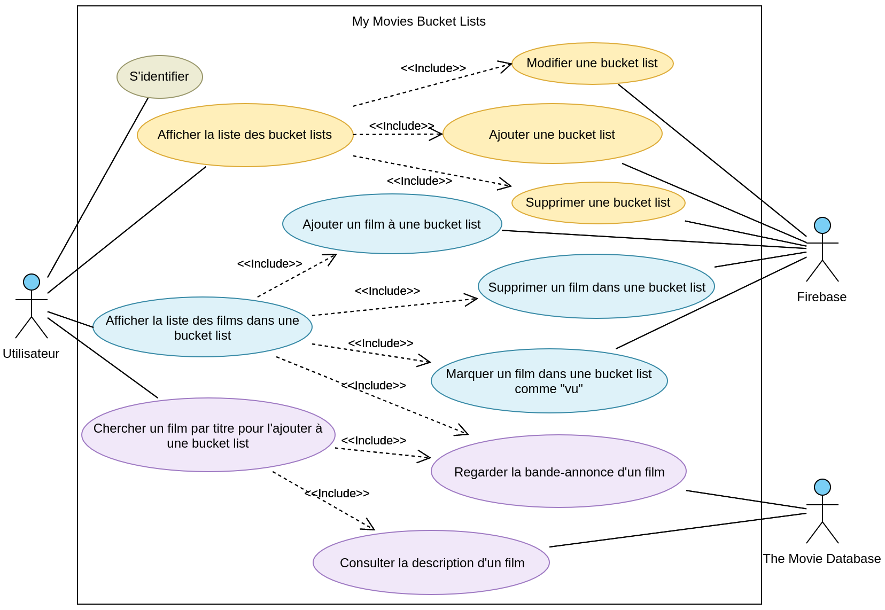
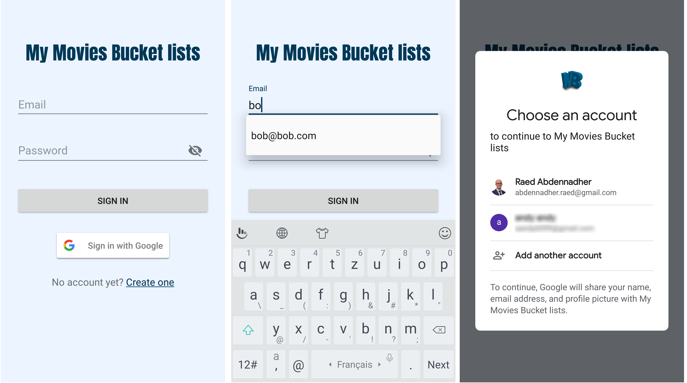
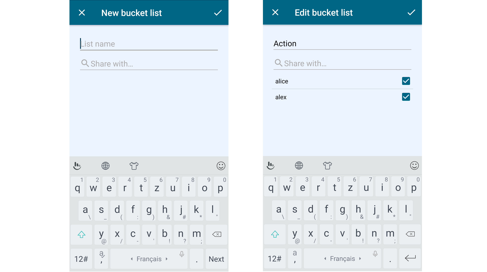

# My Movies Bucket lists

***Raed Abdennadher & Ludovic Gindre***

------

## Introduction

## Analyse

## Conception

### Méthodologie

Pour réaliser ce projet, nous avons travaillé principalement en **Extreme Programming**. Nous avons commencé par fixer les tâches et les fonctionnalités de base de notre application, et nous avions itéré là-dessus.

### Architecture générale

Notre projet respecte l'architecture **MVVM** (Model, View, View-Model) :

* Model : les classes de données
* View : les éléments de l'interface graphique (UI)
* View-Model : la logique qui permet de séparer les données des traitements (dans notre cas, les traitements serons les appels aux différentes ressources externes), et qui assure la liaison entre les données et les éléments graphiques

Après avoir fait quelques recherches, nous avons décidé d'utiliser les services **Firebase** de Google pour le stockage de données, et l'API **The Movie Database** comme source de films (plus d'explications d'utilisation et d'intégration dans la partie *Implémentation*).

La figure suivante (figure 1) illustre l’architecture générale :

<figure class="image">
  
  <figcaption style="text-align: center">
    <em>Figure 1 : Architecture générale</em>
  </figcaption>
</figure>

### Cas d'utilisation

Les différents cas d'utilisation de notre application sont les suivants :

Après avoir été identifié, un utilisateur peut

* Afficher les bucket lists qu'il a créées et les bucket lists partagées avec lui
* Créer une bucket list
* Modifier une bucket list qu'il a créée
* Supprimer une bucket list qu'il acréée
* Ouvrir une bucket list et consulter la liste des films dans celle là
* Ajouter un film à une bucket list
* Supprimer un film dans une bucket list
* Marquer un film comme "vu"
* Chercher un film par son titre pour l'ajouter à une bucket list
* Regarder la bande-annonce d'un film
* Consulter la description d'un film

Le diagramme de cas d'utilisation suivant (figure 2) illustre les fonctionnalités de notre application :

<figure class="image">
  
  <figcaption style="text-align: center">
    <em>Figure 2 : Diagramme de cas d'utilisation</em>
  </figcaption>
</figure>

### Recherche et ajout de films dans une bucket List

Nous allons présenter le scénario le plus important (figure 3) par un diagramme de séquence : Recherche et ajout de films dans une bucket list :

<figure class="image">
  
  <figcaption style="text-align: center">
    <em>Figure 3 : Recherche et ajout de films dans une bucket list</em>
  </figcaption>
</figure>

### Diagramme de classe

Pour respecter l'architecture général, nous avons organisé nos classes en packages (figure 4) :

* **Model** : contient les classes modèles de notre application : `User`, `Bucketlist`, `Movie` et `Video`
* **View** : contient les classes qui construisent l'interface utilisateur (activités, fragments...)
* **ViewModel** : contient les classes responsables de la liaison entre les vus et les modèle, et les appels vers les librairies externes : `BucketlistViewModel` pour Cloud Firestore et `MovieViewModel` pour The Movie Database
* **Firebase** : contient les classes qui sont en liaison directe avec les librairie de Firebase : Cloud Firestore et FirebaseAuth
* **TMDApi** : contient une classe qui envoie des requêtes http au serveur The Movie Database via leur API

<figure class="image">
  
  <figcaption style="text-align: center">
    <em>Figure 4 : Diagramme de classes</em>
  </figcaption>
</figure>

## Implémentation

Nous avons choisi d'utiliser les services **Firebase** de Google pour le stockage de données et la gestion d'authentification, qui offre des librairies riches et complètes Nous avons utilisé les services suivants :

* Le service d'authentification ***Authentification*** : plusieurs fournisseur de connexion possibles : email/Mot de passe, Téléphone, Google, Facebook, Twitter...
* Le service de base de données ***Cloud Firestore*** (*NoSql data base*) : On a deux collections : `users` et `bucketlists`

Pour la partie qui concerne la recherche des films, nous avons choisi d'utiliser l'API offerte par **The Movie Database**.

### Gestion d'authentification

Nous avons essayé de respecter notre architecture que nous avons conçu initialement (MVVM), mais nous avons remarqué, au moment de l'implémentation de la gestion d'authentification, que nous devons faire autrement pour des raisons de simplification.

Voici la logique que nous avons appliqué :

* 3 activités :
  
  * ***SplashActivity*** : cette activité va tout simplement vérifier si l'utilisateur est déjà connecté. Grace à Firebase, cela peut se faire facilement en testant si l'instance de `FirebaseAuth.getInstance().currentUser` est nulle. Si c'est le cas, alors l'utilisateur n'est pas connecté, et l'activité `SignInActivity` va se lancer. Sinon, c'est l'activité `MainActivity` qui va se lancer :
  
  ```kotlin
  if (FirebaseAuth.getInstance().currentUser == null) {
      startActivity(Intent(this, SigninActivity::class.java))
  } else {
      startActivity(Intent(this, MainActivity::class.java))
  }
  ```
  
  * ***SignInActivity*** : cette activité permet à l'utilisateur de se connecter à son compte. Deux méthodes de connexion possibles : 
  
    * **Par adresse e-mail et mot de passe** (figure 5) : il faut d’abord avoir un compte pour pouvoir se connecter (Si ce n'est pas le cas, l'utilisateur doit en créer dans l'activité `SignUpActivity` en cliquant sur `Create one`). Une fois les informations saisies, l'email va être enregistré dans les préférences partagées de l'application afin d'afficher une liste de suggestion la prochaine fois où l'utilisateur se connecte à nouveau (figure 6). Voici un extrait du code qui permet de se connecter avec un email et mot de passe :
  
    ```kotlin
    FirebaseAuth.getInstance().signInWithEmailAndPassword(email, password)
        .addOnCompleteListener {
            if (it.isSuccessful) {
                goToMainActivity()
            } else {
                // handle connection failure
            }
        }
    ```
  
    * **Par un compte Google connecté dans l'appareil** (figure 7) : grâce à Firebase, faire la liaison entre l'application et les comptes enregistrés dans l'appareil devient une tâche facile. Tout d'abord on commence par lancer un `intent`  spécial fourni utilisant la méthode `startActivityForResult`, et après on récupère les informations de connexion (`credentials`) dans la méthode `onActivityResult`. Avec ce mode de connexion, et si l'utilisateur se connecte pour la première fois à l'application, un nouveau document dans la collection `users` de Cloud Firestore, avec l'id généré par Firebase et le nom utilisateur, va être ajouté.
  
    ```kotlin
    ...
    val gso = GoogleSignInOptions.Builder(GoogleSignInOptions.DEFAULT_SIGN_IN)
        .requestIdToken(getString(R.string.default_web_client_id))
        .requestEmail()
        .build()
    val googleSignInClient = GoogleSignIn.getClient(this, gso)
    val signInIntent = googleSignInClient.signInIntent
    startActivityForResult(signInIntent,RC_GOOGLE_SIGN_IN)
    ...
    override fun onActivityResult(requestCode: Int, resultCode: Int, data: Intent?) {
        super.onActivityResult(requestCode, resultCode, data)
        if (requestCode == RC_GOOGLE_SIGN_IN) {
            val task: Task<GoogleSignInAccount> = GoogleSignIn.getSignedInAccountFromIntent(data)
            try {
                val account = task.getResult(ApiException::class.java)
                // check if it's the first time
                firebaseAuthWithGoogle(account)
                goToMainActivity()
            } catch (e: ApiException) {
                // handle connection failure
            }
        }
    }
    ```
  
  

* ***SignUpActivity*** (figure 8) : cette activité permet à l'utilisateur de créer un compte (email/mot de passe) pour pouvoir se connecter et utiliser l'application. En cliquant sur le bouton `SING UP`, un nouveau document dans la collection `users` de Cloud Firestore, avec l'id généré par Firebase et le nom utilisateur, va être ajouté.

```kotlin
...
FirebaseAuth.getInstance().createUserWithEmailAndPassword(email, password)
    .addOnCompleteListener {
        if (it.isSuccessful) {
            UserFirestore.addUserIfFirstTime {
                val intent = Intent(this, MainActivity::class.java)
                startActivity(intent)
                finish()
            }
        } else {
            // handle connection failure
        }
    }
```


### Gérer les bucket lists

Après avoir se connecter, l'activité `MainActivity` se lance (figure 9). Cette activité contient principalement :

* Un objet `NavigationView` qui permet à l'utilisateur de se déconnecter (figure 6)

  ```xml
  <com.google.android.material.navigation.NavigationView
      android:id="@+id/nav_view"
      ...
      app:headerLayout="@layout/nav_header_main"
      app:menu="@menu/activity_main_drawer_menu" />
  ```

* Un objet `fragment` qui permet de charger les différents fragments définis dans le *Navivation Graph* `mobile_navigation.xml`

  ```xml
  <fragment
  	android:id="@+id/nav_host_fragment"
  	android:name="androidx.navigation.fragment.NavHostFragment"
  	...
  	app:defaultNavHost="true"
  	app:navGraph="@navigation/mobile_navigation" />
  ```

  Le fichier `mobile_navigation.xml` permet de gérer les différentes transactions et actions entre les différents fragment, et les différents arguments qu'ils peuvent communiquer.

<figure class="image">
  
  <figcaption style="text-align: center">
    <em>Figure 9 : Diagramme de classes</em>
  </figcaption>
</figure>

Comme on peut le remarquer dans ce graphe, le fragment qui va s'afficher en premier dans la `MainActivity` sera `BucketlistFragment` (l’icône de la maison).

#### BucketlistFragment

Depuis ce fragment, l'utilisateur peu :

* Se déconnecter (figure 11)

* Consulter la liste des bucket lists qu'il a créées lui même ("Comedy" et "Action" dans le figure 10) et celles partagées avec lui, que d'autres utilisateurs ont créées ("Drama"). Deux objets `RecyclerView` vont contenir ces deux listes, et les mettre à jour grâce à un adaptateur spécial offert par la librairie de Cloud Firestore : `FirestoreRecyclerAdapter<Model, ViewHolder>(options)`, en voici l'utilisation :

  ```kotlin
  ...
  private val firestoreInstance: FirebaseFirestore by lazy { 
      FirebaseFirestore.getInstance() 
  }
  ...
  val bucketlistsCollRef = firestoreInstance.collection("bucketlists")
  val query = bucketlistsCollRef
  	.whereEqualTo("createdBy.id", FirebaseAuth.getInstance().currentUser!!.uid)
  	.orderBy("creationTimestamp", Query.Direction.DESCENDING)
  
  val recyclerOptions = FirestoreRecyclerOptions.Builder<Bucketlist>()
      .setQuery(query, Bucketlist::class.java)
      .build()
  
  val recyclerAdapterOwned = 
  	BucketlistAdapter(recyclerOptions, BucketlistAdapter.Type.OWNED)
  ```

  ```kotlin
  class BucketlistAdapter(
      options: FirestoreRecyclerOptions<Bucketlist>, 
      private val type: Type
  ) : FirestoreRecyclerAdapter<Bucketlist, BucketlistHolder>(options) {
      enum class Type { OWNED, SHARED}
      ...
       inner class BucketlistHolder(
           private val view: View, 
           private val type: Type
       ): RecyclerView.ViewHolder(view) {
           ...
       }
      ...
  }
  ```

* Ajouter une bucket list en cliquant sur le bouton flottant "+" en bas à gauche

* Modifier une de ses propres bucket lists en glissant (swipe) l'élément vers la droite (figure 12)

* Supprimer une de ses propres bucket lists en glissant (swipe) l'élément vers la gauche (figure 13)

Pour les actions de "swipe", nous avons créé une classe `ItemSwipeController` qui hérite de la classe abstraite `ItemTouchHelper.Callback`, et que nous avons attaché à notre `RecyclerView` :

```kotlin
class ItemSwipeController(
    private val buttonsActions: OnSwipedListener,
    private val directions: Int
): ItemTouchHelper.Callback() {
    ...
    fun onDraw(c: Canvas) {
        if (currentItemViewHolder != null) {
            // Draw the edit and the delete round buttons
            drawButtons(c)
        }
    }
    interface OnSwipedListener {
        fun onDeleteButtonClick(position: Int)
        fun onEditButtonClick(position: Int)
    }
}

// Usage:
val swipeController = ItemSwipeController(
    object : ItemSwipeController.OnSwipedListener {
        override fun onDeleteButtonClick(position: Int) {
            // Delete routine
        }
        override fun onEditButtonClick(position: Int) {
            // Edit routine
        }
    }, 
    ItemTouchHelper.LEFT or ItemTouchHelper.RIGHT
)

val itemTouchhelper = ItemTouchHelper(swipeController)
itemTouchhelper.attachToRecyclerView(recyclerViewOwned)

recyclerViewOwned.addItemDecoration(object : ItemDecoration() {
    override fun onDraw(c: Canvas, parent: RecyclerView, state: RecyclerView.State) {
        swipeController.onDraw(c)
    }
})
```


#### AddEditBucketlistFragment

Quand l'utilisateur choisie d'ajouter (figure 14) ou de modifier (figure 15) une bicket list, l'activité principale va charger ce fragment `AddEditBucketlistFragment`. Dans les deux cas, ce fragment est chargé avec les arguments suivants : `fragmentTitle: String`, `bucketlistId: String` et `action: Enum` (peut être `ADD` ou `EDIT`)

```xml
<fragment android:id="@+id/AddEditBucketlistFragment" ... >
    <argument
         android:name="fragmentTitle"
         app:argType="reference"
         android:defaultValue="@string/new_bucket_list" />
    <argument
         android:name="bucketlistId"
         app:argType="string"
         app:nullable="true"
         android:defaultValue="@null" />
    <argument
         android:name="action"
         app:argType="mse.mobop.mymoviesbucketlists.utils.BucketlistAction"
         android:defaultValue="ADD" />
```

* S'il s'agit d'une opération d'ajout, les arguments auront les valeurs par défaut `New bucket list`, `null` et `ADD` respectivement :

  ```kotlin
  findNavController()
      .navigate(R.id.action_BucketlistsFragment_to_AddEditBucketlistFragment)
  ```

* S'il s'agit d'une opération de modification, les arguments auront les valeurs `Edit bucket list`, `<l'id de la bucket list en question>` et `EDIT` respectivement :

  ```kotlin
  val direction = BucketlistFragmentDirections
  	.actionBucketlistsFragmentToAddEditBucketlistFragment(
          fragmentTitle = R.string.edit_bucket_list,
          bucketlistId = bucketlist.id,
          action = BucketlistAction.EDIT
      )
  findNavController().navigate(direction)
  ```

> `action_BucketlistsFragment_to_AddEditBucketlistFragment` est définie dans le `NavGraph` :
>
> ```xml
> <fragment android:id="@+id/BucketlistFragment" ... >
> 	<action
> 		android:id="@+id/action_BucketlistsFragment_to_AddEditBucketlistFragment"
>         app:destination="@id/AddEditBucketlistFragment"
>         ... />
>     ...
> </fragment>
> ```

Dans le fragment `AddEditBucketlistFragment`, on peut récupérer les valeurs des arguments via la méthode statique `AddEditBucketlistFragmentArgs.fromBundle(arguments!!)` générée par Android Studio au moment du `Build` de l'application, grace au `NavGraph` :

```kotlin
val bandle = AddEditBucketlistFragmentArgs.fromBundle(arguments!!)
val fragmentTitle = bandle.fragmentTitle
val bucketlistId = bandle.bucketlistId
val action = bandle.action
```



#### OneBucketlistFragment

Par un simple clic sur un des éléments des `RecyclerView`s dans le fragment `BucketlistFragment` (figure 10), le système navigue vers le fragment `OneBucketlistFragment` (figure 16) en suivant la même logique expliqué dans la partie précédente (utilisant le `NavGraph`). Ce fragment attend les arguments suivants :

* `bucketlistId: String` utilisé pour chargé la bucket list en question depuis la base de données Cloud Firestore
* `ownerId: String` utilisé pour mettre en place ou pas, à l'utilisateur, le menu pour modifier et supprimer la bucket list (les bouton en haut à droite dans la figure 16)

La liste des films du bucket list est représentée dans un `RecyclerView` : le poster du film, sont titre, et la date dans laquelle ce film à été ajouté à cette bucket list. Pour toutes les images qui viennent depuis internet dans notre application, nous avons utilisé la librairie ***Glide*** (v4.10.0) (lien dans les références). L'utilisation de cette librairie est très simple. Il suffit de fournir principalement le contexte, l'URL vers l'image en question, l'objet `ImageView` dans lequel nous voulons charger l'image (en mode asynchrone), et les routines des actions à exécuter en cas de succès ou d’échec :

```kotlin
Glide
    .with(context)
    .load(BASE_URL_IMG + movie.posterPath)
    .listener(object : RequestListener<Drawable> {
        override fun onResourceReady(
            resource: Drawable?,
            model: Any?,
            target: com.bumptech.glide.request.target.Target<Drawable>?,
            dataSource: DataSource?,
            isFirstResource: Boolean
        ): Boolean {
            // Handle success
            return false
        }
        override fun onLoadFailed(
            e: GlideException?,
            model: Any?,
            target: com.bumptech.glide.request.target.Target<Drawable>?,
            isFirstResource: Boolean
        ): Boolean {
            // Handle failure
            return false
        }
    })
    .diskCacheStrategy(DiskCacheStrategy.ALL) // Cache both original & resized image
    .centerCrop() // Center and crop the image in its container
    .transition(withCrossFade()) // Image apears with fade animation
    .into(movie_poster) // Container => ImageView
```

Le simple clic sur un film bascule l'état du film (non vue / déjà vu). Le clic sur le bouton "-" en bas à gauche va changer la vu en mode suppression : cela change l'action du clic sur un film à une action de suppression à la place le l'action de basculement (figure 17). Le clic long sur un élément permet d'ouvrir un `AlertDialog` personnalisé affichant le poster, la description et les différentes bandes-annonces et vidéos liées au film (figure 18).

Les différentes informations liées à un film (depuis The Movie Database) sont déjà enregistrées dans la base de données Cloud Firestore au moment de l'ajout d'un film dans une bucket list (explication dans la partie suivante). Mais pour les vidéos liées au film, il faut lancer une nouvelle requête`GET` vers l'API The Movie Database `movie/{movie_id}/videos`. La réponse de cette requête est une liste de vidéos YouTube identifiées par un `key`. Pour afficher les vidéos YouTube, nous avons utiliser la librairie ***android-youtube-player*** fournie par **PierfrancescoSoffritti** (lien dans les références). Nous avons préféré d'utiliser cette librairie, à la place de la librairie officielle de YouTube *YouTube Android Player API*, pour différentes raisons expliquées dans la partie **Problèmes rencontrés**. L'utilisation de cette librairie :

* Ajout de l'objet `YouTubePlayerView` dans la vue :

```xml
<com.pierfrancescosoffritti.androidyoutubeplayer.core.player.views.YouTubePlayerView
        android:id="@+id/youtube_player_view"
        android:layout_width="wrap_content"
        android:layout_height="wrap_content"
        app:showFullScreenButton="false"/>
```

* Chargement de la vidéo dynamiquement :

```kotlin
youtubePlayerView.addYouTubePlayerListener(
    object : AbstractYouTubePlayerListener() {
        override fun onReady(youTubePlayer: YouTubePlayer) {
            youTubePlayer.loadVideo(video.key, 0f)
            // First parameter is the video youtube key
            // Second parameter is from where to start the video (in seconds)
        }
    }
)
```


### Support de deux langages

## Problèmes rencontrés

## Conclusion

## Références
