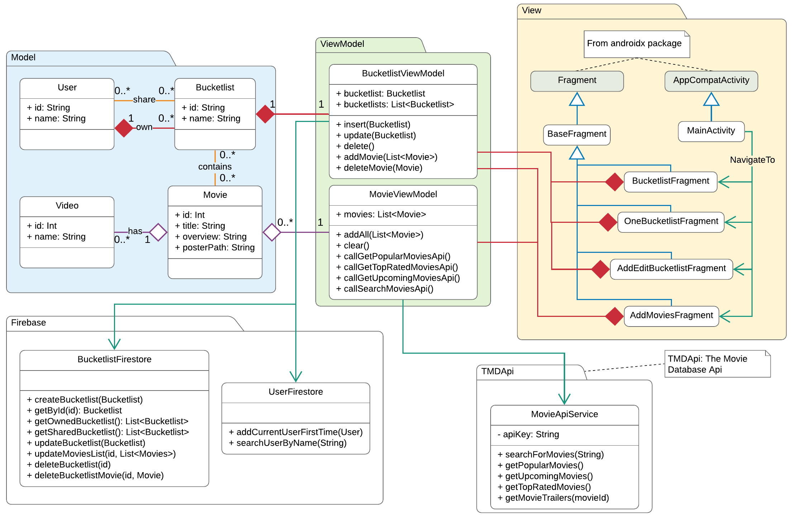
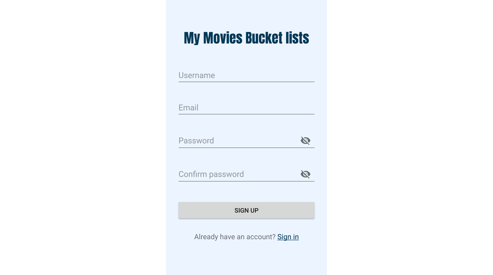
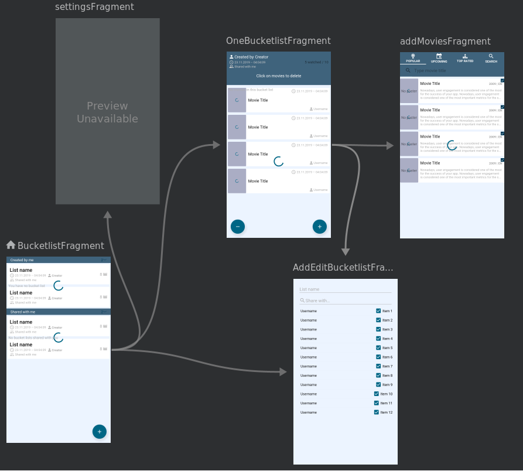

# My Movies Bucket lists

***Raed Abdennadher & Ludovic Gindre***

------

## Introduction

## Analyse

## Conception

### Méthodologie

Pour réaliser ce projet, nous avons travaillé principalement en **Extreme Programming**. Nous avons commencé par fixer les tâches et les fonctionnalités de base de notre application, et nous avions itéré là-dessus.

#### Architecture générale

Notre projet respecte l'architecture **MVVM** (Model, View, View-Model) :

* Model : les classes de données
* View : les éléments de l'interface graphique (UI)
* View-Model : la logique qui permet de séparer les données des traitements (dans notre cas, les traitements serons les appels aux différentes ressources externes), et qui assure la liaison entre les données et les éléments graphiques

Après avoir fait quelques recherches, nous avons décidé d'utiliser les services **Firebase** de Google pour le stockage de données, et l'API **The Movie Database** comme source de films (plus d'explications d'utilisation et d'intégration dans la partie *Implémentation*).

La figure suivante illustre l’architecture générale :

<figure class="image">
  
  <figcaption style="text-align: center">
    <em>Architecture générale</em>
  </figcaption>
</figure>

#### Cas d'utilisation

Les différents cas d'utilisation de notre application sont les suivants :

Après avoir été identifié, un utilisateur peut

* Afficher les bucket lists qu'il a créées et les bucket lists partagées avec lui
* Créer une bucket list
* Modifier une bucket list qu'il a créée
* Supprimer une bucket list qu'il acréée
* Ouvrir une bucket list et consulter la liste des films dans celle là
* Ajouter un film à une bucket list
* Supprimer un film dans une bucket list
* Marquer un film comme "vu"
* Chercher un film par son titre pour l'ajouter à une bucket list
* Regarder la bande-annonce d'un film
* Consulter la description d'un film

Le diagramme de cas d'utilisation suivant illustre les fonctionnalités de notre application :

<figure class="image">
  
  <figcaption style="text-align: center">
    <em>Diagramme de cas d'utilisation</em>
  </figcaption>
</figure>

#### Recherche et ajout de films dans une bucket List

Nous allons présenter le scénario le plus important par un diagramme de séquence : Recherche et ajout de films dans une bucket list :

<figure class="image">
  
  <figcaption style="text-align: center">
    <em>Recherche et ajout de films dans une bucket list</em>
  </figcaption>
</figure>

#### Diagramme de classe

<figure class="image">
  
  <figcaption style="text-align: center">
    <em>Diagramme de classes</em>
  </figcaption>
</figure>

## Implémentation

Nous avons choisi d'utiliser les services **Firebase** de Google pour le stockage de données et la gestion d'authentification, qui offre des librairies riches et complètes Nous avons utilisé les services suivants :

* Le service d'authentification ***Authentification*** : plusieurs fournisseur de connexion possibles : email/Mot de passe, Téléphone, Google, Facebook, Twitter...
* Le service de base de données ***Cloud Firestore*** (*NoSql data base*) : On a deux collections : `users` et `bucketlists`

Pour la partie qui concerne la recherche des films, nous avons choisi d'utiliser l'API offerte par **The Movie Database**.

### Gestion d'authentification

Nous avons essayé de respecter notre architecture que nous avons conçu initialement (MVVM), mais nous avons remarqué, au moment de l'implémentation de la gestion d'authentification, que nous devons faire autrement pour des raisons de simplification.

Voici la logique que nous avons appliqué :

* 3 activités :
  
  * ***SplashActivity*** : cette activité va tout simplement vérifier si l'utilisateur est déjà connecté. Grace à Firebase, cela peut se faire facilement en testant si l'instance de `FirebaseAuth.getInstance().currentUser` est nulle. Si c'est le cas, alors l'utilisateur n'est pas connecté, et l'activité `SignInActivity` va se lancer. Sinon, c'est l'activité `MainActivity` qui va se lancer :
  
  ```kotlin
  if (FirebaseAuth.getInstance().currentUser == null) {
      startActivity(Intent(this, SigninActivity::class.java))
  } else {
      startActivity(Intent(this, MainActivity::class.java))
  }
  ```
  
  * ***SignInActivity*** : cette activité permet à l'utilisateur de se connecter à son compte. Deux méthodes de connexion possibles : 
  
    * **Par adresse e-mail et mot de passe** (capture d'écran 1) : il faut d’abord avoir un compte pour pouvoir se connecter (Si ce n'est pas le cas, l'utilisateur doit en créer dans l'activité `SignUpActivity` en cliquant sur `Create one`). Une fois les informations saisies, l'email va être enregistré dans les préférences partagées de l'application afin d'afficher une liste de suggestion la prochaine fois où l'utilisateur se connecte à nouveau (capture d'écran 2). Voici un extrait du code qui permet de se connecter avec un email et mot de passe :
  
    ```kotlin
    FirebaseAuth.getInstance().signInWithEmailAndPassword(email, password)
        .addOnCompleteListener {
            if (it.isSuccessful) {
                goToMainActivity()
            } else {
                // handle connection failure
            }
        }
    ```
  
    * **Par un compte Google connecté dans l'appareil** (capture d'écran 3) : grâce à Firebase, faire la liaison entre l'application et les comptes enregistrés dans l'appareil devient une tâche facile. Tout d'abord on commence par lancer un `intent`  spécial fourni utilisant la méthode `startActivityForResult`, et après on récupère les informations de connexion (`credentials`) dans la méthode `onActivityResult`. Avec ce mode de connexion, et si l'utilisateur se connecte pour la première fois à l'application, un nouveau document dans la collection `users` de Cloud Firestore, avec l'id généré par Firebase et le nom utilisateur, va être ajouté.
  
    ```kotlin
    ...
    val gso = GoogleSignInOptions.Builder(GoogleSignInOptions.DEFAULT_SIGN_IN)
        .requestIdToken(getString(R.string.default_web_client_id))
        .requestEmail()
        .build()
    val googleSignInClient = GoogleSignIn.getClient(this, gso)
    val signInIntent = googleSignInClient.signInIntent
    startActivityForResult(signInIntent,RC_GOOGLE_SIGN_IN)
    ...
    override fun onActivityResult(requestCode: Int, resultCode: Int, data: Intent?) {
        super.onActivityResult(requestCode, resultCode, data)
        if (requestCode == RC_GOOGLE_SIGN_IN) {
            val task: Task<GoogleSignInAccount> = GoogleSignIn.getSignedInAccountFromIntent(data)
            try {
                val account = task.getResult(ApiException::class.java)
                // check if it's the first time
                firebaseAuthWithGoogle(account)
                goToMainActivity()
            } catch (e: ApiException) {
                // handle connection failure
            }
        }
    }
    ```
  
  

* ***SignUpActivity*** (capture d'écran 4) : cette activité permet à l'utilisateur de créer un compte (email/mot de passe) pour pouvoir se connecter et utiliser l'application. En cliquant sur le bouton `SING UP`, un nouveau document dans la collection `users` de Cloud Firestore, avec l'id généré par Firebase et le nom utilisateur, va être ajouté.

```kotlin
...
FirebaseAuth.getInstance().createUserWithEmailAndPassword(email, password)
    .addOnCompleteListener {
        if (it.isSuccessful) {
            UserFirestore.addUserIfFirstTime {
                val intent = Intent(this, MainActivity::class.java)
                startActivity(intent)
                finish()
            }
        } else {
            // handle connection failure
        }
    }
```



### Gérer les bucket lists

Après avoir se connecter, l'activité `MainActivity` se lance (capture d'écran 5). Cette activité contient principalement :

* Un objet `NavigationView` qui permet à l'utilisateur de se déconnecter (capture d'écran 6)

  ```xml
  <com.google.android.material.navigation.NavigationView
      android:id="@+id/nav_view"
      ...
      app:headerLayout="@layout/nav_header_main"
      app:menu="@menu/activity_main_drawer_menu" />
  ```

* Un objet `fragment` qui permet de charger les différents fragments définis dans le *Navivation Graph* `mobile_navigation.xml`

  ```xml
  <fragment
  	android:id="@+id/nav_host_fragment"
  	android:name="androidx.navigation.fragment.NavHostFragment"
  	...
  	app:defaultNavHost="true"
  	app:navGraph="@navigation/mobile_navigation" />
  ```

  Le fichier `mobile_navigation.xml` permet de gérer les différentes transactions et actions entre les différents fragment, et les différents arguments qu'ils peuvent communiquer.



Comme on peut le remarquer dans ce graphe, le fragment qui va s'afficher en premier dans la `MainActivity` sera `BucketlistFragment` (l’icône de la maison).

#### BucketlistFragment

Depuis ce fragment, l'utilisateur peu :

* Consulter la liste des bucket lists qu'il a créées lui même ("Comedy" et "Action" dans le capture d'écran 5) et celles partagées avec lui, que d'autres utilisateurs ont créées ("Drama"). Deux objets `RecyclerView` vont contenir ces deux listes, et les mettre à jour grâce à un adaptateur spécial offert par la librairie de Cloud Firestore : `FirestoreRecyclerAdapter<Model, ViewHolder>(options)`, en voici l'utilisation :

  ```kotlin
  ...
  private val firestoreInstance: FirebaseFirestore by lazy { 
      FirebaseFirestore.getInstance() 
  }
  ...
  val bucketlistsCollRef = firestoreInstance.collection("bucketlists")
  val query = bucketlistsCollRef
  	.whereEqualTo("createdBy.id", FirebaseAuth.getInstance().currentUser!!.uid)
  	.orderBy("creationTimestamp", Query.Direction.DESCENDING)
  
  val recyclerOptions = FirestoreRecyclerOptions.Builder<Bucketlist>()
      .setQuery(query, Bucketlist::class.java)
      .build()
  
  val recyclerAdapterOwned = 
  	BucketlistAdapter(recyclerOptions, BucketlistAdapter.Type.OWNED)
  ```

  ```kotlin
  class BucketlistAdapter(
      options: FirestoreRecyclerOptions<Bucketlist>, 
      private val type: Type
  ) : FirestoreRecyclerAdapter<Bucketlist, BucketlistHolder>(options) {
      enum class Type { OWNED, SHARED}
      ...
       inner class BucketlistHolder(
           private val view: View, 
           private val type: Type
       ): RecyclerView.ViewHolder(view) {
           ...
       }
      ...
  }
  ```

* Ajouter une bucket list en cliquant sur le bouton flottant "+" en bas à gauche
* Modifier une de ses propres bucket lists en glissant (swipe) l'élément vers la droite (capture 7)
* Supprimer une de ses propres bucket lists en glissant (swipe) l'élément vers la gauche (capture 8)


#### AddEditBucketlistFragment


### Support de deux langages

## Problèmes rencontrés

## Conclusion

## Références
