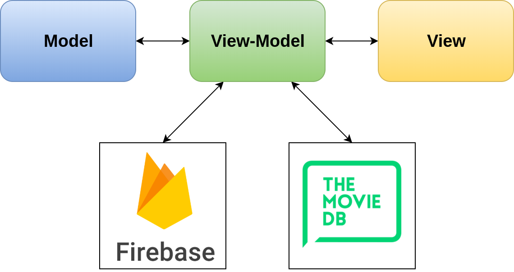

# My Movies Bucket lists

***Raed Abdennadher & Ludovic Gindre***

------

## Introduction

## Analyse

## Conception

### Méthodologie

Pour réaliser ce projet, nous avons travaillé principalement en **Extreme Programming**. Nous avons commencé par fixer les tâches et les fonctionnalités de base de notre application, et nous avions itéré là-dessus.

#### Architecture générale

Notre projet respecte l'architecture **MVVM** (Model, View, View-Model) :

* Model : les classes de données
* View : les éléments de l'interface graphique (UI)
* View-Model : la logique qui permet de séparer les données des traitements (dans notre cas, les traitements serons les appels aux différentes ressources externes), et qui assure la liaison entre les données et les éléments graphiques

Après avoir fait quelques recherches, nous avons décidé d'utiliser les services **Firebase** de Google pour le stockage de données, et l'api **The Movie Database** comme source de films (plus d'explications d'utilisation et d'intégration dans la partie *Implémentation*).

La figure suivante illustre l’architecture générale :

<figure class="image">
  
  <figcaption style="text-align: center">
    <em>Architecture générale</em>
  </figcaption>
</figure>

#### Cas d'utilisation

Les différents cas d'utilisation de notre application sont les suivants :

Après avoir été identifié, un utilisateur peut

* Afficher les bucket lists qu'il a créées et les bucket lists partagées avec lui
* Créer une bucket list
* Modifier une bucket list qu'il a créée
* Supprimer une bucket list qu'il acréée
* Ouvrir une bucket list et consulter la liste des films dans celle là
* Ajouter un film à une bucket list
* Supprimer un film dans une bucket list
* Marquer un film comme "vu"
* Chercher un film par son titre pour l'ajouter à une bucket list
* Regarder la bande-annonce d'un film
* Consulter la description d'un film

Le diagramme de cas d'utilisation suivant illustre les fonctionnalités de notre application :

<figure class="image">
  
  <figcaption style="text-align: center">
    <em>Diagramme de cas d'utilisation</em>
  </figcaption>
</figure>

#### Recherche et ajout de films dans une bucket List

Nous allons présenter le scénario le plus important par un diagramme de séquence : Recherche et ajout de films dans une bucket list :

<figure class="image">
  
  <figcaption style="text-align: center">
    <em>Recherche et ajout de films dans une bucket list</em>
  </figcaption>
</figure>

#### Diagramme de classe

## Implémentation

## Problèmes rencontrés

## Conclusion